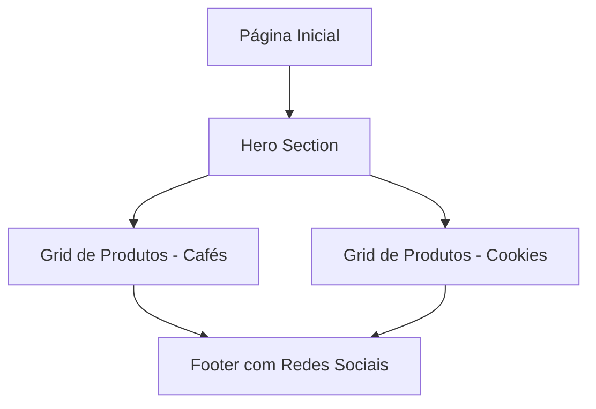

## 1. Product Overview
Cardápio online estático para a cafeteria Calmô Cafés e Cookies, transmitindo sofisticação e minimalismo. A página web apresenta os produtos da cafeteria com design elegante, inspirado na identidade visual da marca que valoriza momentos de pausa e delicadeza.

- **Público-alvo**: Clientes da cafeteria que buscam visualizar o cardápio de forma prática e elegante
- **Valor do produto**: Facilitar o acesso ao cardápio da cafeteria com experiência visual sofisticada que reflita a identidade da marca

## 2. Core Features

### 2.1 User Roles
Este produto não requer distinção de papéis de usuário, sendo um site estático de apresentação.

### 2.2 Feature Module
O cardápio online consiste na seguinte página principal:
1. **Página Inicial**: Hero section com identidade da marca, grid de produtos organizados por categorias (Cafés e Cookies), footer com informações de contato e redes sociais.

### 2.3 Page Details
| Page Name | Module Name | Feature description |
|-----------|-------------|---------------------|
| Página Inicial | Hero Section | Apresentar logo e nome da cafeteria com imagem heroíca de café, transmitir a essência da marca com tipografia curva e tons neutros |
| Página Inicial | Grid de Produtos | Exibir produtos em cards organizados por categorias (Cafés e Cookies), cada card contendo imagem, nome e preço do produto |
| Página Inicial | Footer | Incluir ícones de redes sociais (Instagram, WhatsApp), horário de funcionamento e informações de contato |

## 3. Core Process
O usuário acessa a página inicial e visualiza imediatamente o hero section com a identidade da Calmô. Ao scrollar, encontra o grid de produtos organizado por categorias, podendo visualizar todos os itens do cardápio. No final da página, encontra as informações de contato e pode acessar as redes sociais através dos ícones.

## 4. User Interface Design

### 4.1 Design Style
- **Cores primárias**: Tons de creme (#F5F1EB, #E8DDD4) e bege claro
- **Cores secundárias**: Detalhes em laranja suave (#D4A574) e marrom café (#8B6F47)
- **Tipografia**: Fontes serifadas elegantes com curvas suaves para títulos, sans-serif clean para textos
- **Botões**: Estilo minimalista com bordas arredondadas sutis, hover effects suaves
- **Layout**: Baseado em cards com espaçamento generoso, navegação single-page scroll
- **Ícones**: Estilo line-art minimalista para redes sociais

### 4.2 Page Design Overview
| Page Name | Module Name | UI Elements |
|-----------|-------------|-------------|
| Página Inicial | Hero Section | Imagem de café em alta resolução com overlay sutil, logo Calmô centralizado, tipografia curva personalizada, botão "Ver Cardápio" com scroll suave |
| Página Inicial | Grid de Produtos | Cards com border-radius 12px, sombra sutil, imagens com aspect-ratio 4:3, tipografia hierárquica clara (nome em negrito, preço em cor secundária) |
| Página Inicial | Footer | Background em tom mais escuro, ícones de redes sociais com hover effects, texto de copyright minimalista |

### 4.3 Responsiveness
- **Desktop-first**: Otimizado para telas grandes com layout expansivo
- **Mobile-adaptive**: Adaptação fluida para tablets e smartphones com grid responsivo
- **Touch optimization**: Áreas de toque adequadas para dispositivos móveis, scroll suave