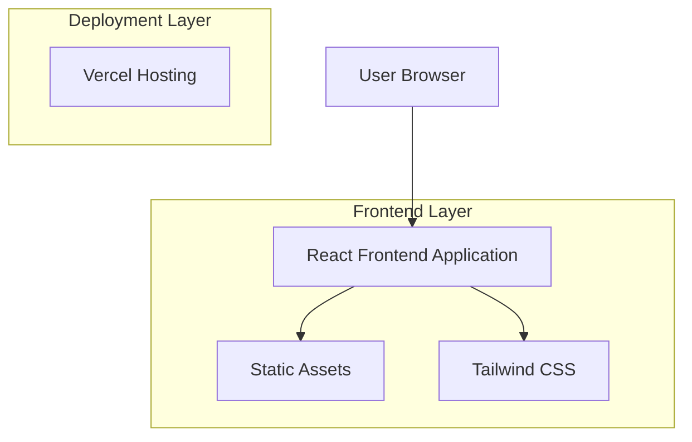

## 1. Architecture design



## 2. Technology Description
- Frontend: React@18 + tailwindcss@3 + vite
- Initialization Tool: vite-init
- Backend: None (Site Estático)
- Deployment: Vercel (hospedagem gratuita)

## 3. Route definitions
| Route | Purpose |
|-------|---------|
| / | Página inicial com hero section, grid de produtos e footer |

## 4. Component Architecture
### 4.1 Core Components
```
src/
├── components/
│   ├── HeroSection.jsx
│   ├── ProductGrid.jsx
│   ├── ProductCard.jsx
│   ├── Footer.jsx
│   └── SocialIcons.jsx
├── assets/
│   ├── images/
│   └── fonts/
├── styles/
│   └── globals.css
└── App.jsx
```

### 4.2 Data Structure
```javascript
// Product Type Definition
interface Product {
  id: string;
  name: string;
  price: string;
  category: 'cafes' | 'cookies';
  image: string;
}

// Social Link Type Definition
interface SocialLink {
  platform: 'instagram' | 'whatsapp';
  url: string;
  icon: string;
}
```

### 4.3 Performance Optimization
- Imagens otimizadas em formato WebP
- Lazy loading para imagens do grid
- CSS minificado e comprimido
- Code splitting automático via Vite

### 4.4 SEO e Metatags
- Meta tags dinâmicas para redes sociais
- Schema.org para local business
- Sitemap.xml automático
- Robots.txt configurado